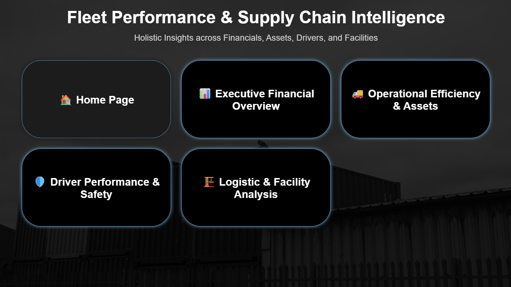
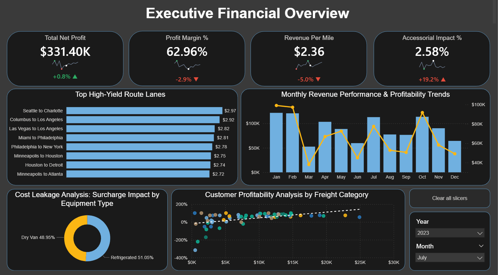
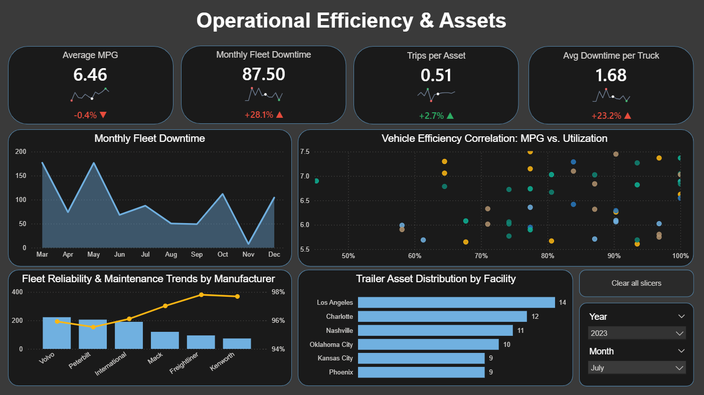
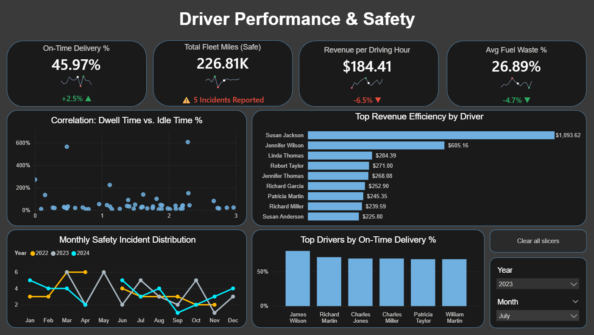
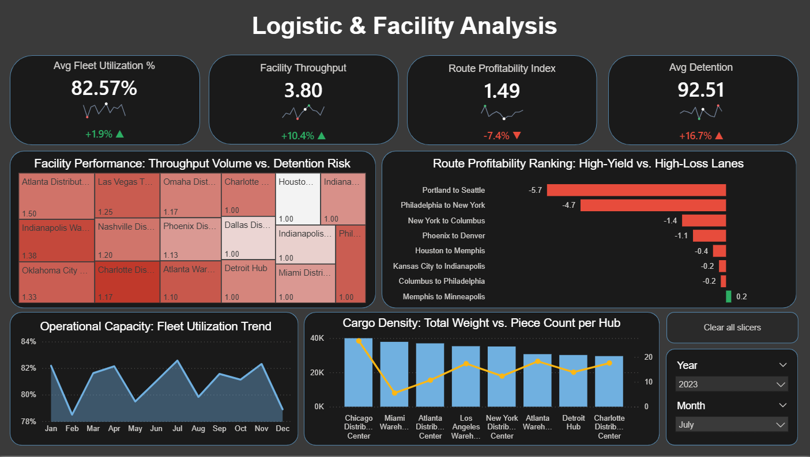
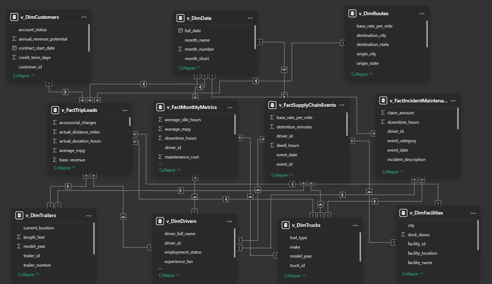

## Fleet Performance & Supply Chain Intelligence Dashboard 🚛📊

### 📋 Project Overview

This project delivers a 5-page interactive Power BI Intelligence Suite designed for global logistics and fleet management. By integrating fragmented data across financials, assets, and labor, the dashboard provides a "Command Center" view of the supply chain. It empowers stakeholders to identify high-cost corridors, monitor vehicle health, and optimize driver performance through real-time data storytelling.

---

### 🔗 Quick Access

* 📊 [**View Executive Performance Report (PDF)**](Report_and_Dashboard/Fleet_Performance_Supply_Chain_Intelligence_Report.pdf)
  
* 🛠️ [**Download Power BI Dashboard (.pbix)**](Report_and_Dashboard/Logistics_Intelligence_Command_Center_v1.pbix)
  
* 💾 [**View SQL Gold-Layer Transformation Scripts**](SQL_Scripts/gold/Logistic_Gold_Layer_Views)

---

### 🛠️ Data Architecture (Star Schema)

The project is built on a robust Star Schema involving 11 optimized views, ensuring efficient filtering and high-performance calculations across large datasets.

**Fact Tables** (Transactional Data)

- v_FactTripLoads: The core transactional table containing revenue, distances, and freight details.

- v_FactMonthlyMetrics: Aggregated monthly snapshots for high-level executive trend analysis.

- v_FactSupplyChainEvents: Tracks lifecycle events of shipments, from dispatch to delivery.

- v_FactIncidentMaintenance: Records all safety incidents, maintenance costs, and asset downtime.

**Dimension Tables** (Lookup Data)

- v_DimDate: A comprehensive calendar table supporting all Time Intelligence (YoY, Month-on-Month) measures.

- v_DimTrucks & v_DimTrailers: Detailed asset attributes (Brand, Model Year, Type) for fleet health tracking.

- v_DimDrivers: Personal and performance profiles for labor efficiency analysis.

- v_DimCustomers: Geographic and segment data for client-side profitability analysis.

- v_DimFacilities: Warehouse and hub location details.

- v_Routes: Defined logistics corridors used to calculate the Route Profitability Index (RPI).

 --- 

### 🖼️ Visualizations & Insights

💡 Tip: Click on any heading below to view the interactive dashboard screenshots and deep-dive insights.

--- 

  
 🏠 Home Page (Navigation Hub) 

   
  

- **Centralized Navigation**: Custom UI/UX with button-driven navigation for a "Web App" feel.

- **High-Level Branding**: Professional dark-mode design with clear project categorization.
  
---

 

  
 📊 Executive Financial Overview 

   
  

- **Profitability Analysis**: Real-time monitoring of Net Profit ($193.46K) and Profit Margins (72.41%).

- **Revenue vs. Profit Correlation**: Identifies which freight types (Automotive vs. Food) drive the highest margins.

- **Route Profitability**: Visualizes the most lucrative "Lanes" in the network (e.g., Charlotte to Portland).
  
---

  
 🚚 Operational Efficiency & Assets 

   
  

- **Asset Health**: Tracks Fleet Uptime (90.28%) vs. Downtime Hours to predict maintenance cycles.

- **Brand Reliability**: Compares downtime trends across brands like Mack, Volvo, and Freightliner.

- **Timeline Insights**: Analyzes downtime by model year to identify aging assets (2015-2017) requiring replacement.

--- 

  
🛡️ Driver Performance & Safety 

   
  
 

   
- **On-Time Delivery (OTD)**: Benchmarks driver efficiency to ensure customer satisfaction.

- **Dwell Time Analysis**: Identifies bottlenecks at facilities where drivers are stuck in idle time.

- **Revenue Ranking**: Highlights top-performing drivers based on Revenue per Active Hour.

---

  
 🏗️ Logistic & Facility  Analysis

   
  
  

- **Route Profitability Index (RPI)**: Uses a red/green heatmap to isolate losing routes (e.g., New York to Philadelphia).

- **Incident Impact**: Quantifies the financial cost of customer complaints vs. insurance claims.

- **Facility Throughput**: Ranks warehouses by volume to optimize resource allocation.

---

 

  
 Data Model 

   
  
  

  ---

### 🧰 Tools & Skills Used

- **Power BI**: Advanced visualization, UI/UX design, and report publishing.

- **DAX (Data Analysis Expressions)**:

      Time Intelligence: YoY Growth, Prior Year (PY) calculations.
      
      Dynamic Labels: Handling nulls/blanks for professional "0.0%" reporting.
      
      Custom Metrics: Route Profitability Index (RPI) and Fleet Utilization %.
      
      Power Query: Data cleaning, ETL processes, and merging disparate datasets.
      
      Data Modeling: Star Schema design, managing Many-to-One relationships.

---

### 👤 Author: Meenakshi Singh | Aspiring Data Analyst

Specializing in SQL, Data Modeling, and Business Intelligence.

